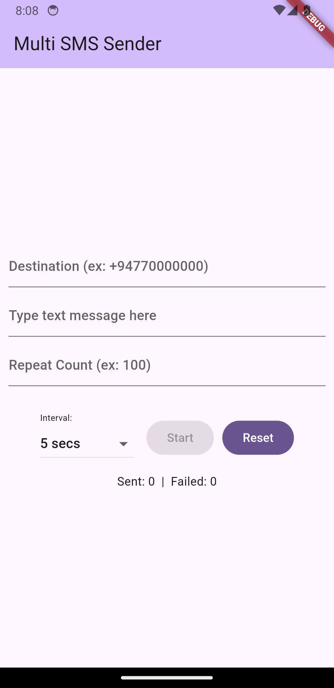

# SMS Voting App

This Flutter mobile app allows users to send multiple SMS messages to a single destination. It was specifically built for participating in SMS voting systems used by some television programs, such as voice competitions. 

## Background

The inspiration for this app came when my girlfriend's brother participated in a voice competition called "Derana Little Star". To support him, I created this app to make the SMS voting process easier and more efficient.

## Features

- Send multiple SMS messages to a single destination
- Simple and user-friendly interface
- Built with Flutter for cross-platform compatibility

## Screenshot



## Packages Used

- `easy_send_sms: ^0.0.1`

## Installation

To use this app, follow these steps:

1. Clone the repository:
   ```bash
   git clone https://github.com/tharushaudana/multi_sms_sender_flutter.git
   ```
2. Navigate to the project directory:
   ```bash
   cd multi_sms_sender_flutter
   ```
3. Install the dependencies:
   ```bash
   flutter pub get
   ```
4. Run the app:
   ```bash
   flutter run
   ```

## Usage

1. Open the app.
2. Enter the phone number you want to send SMS messages to.
3. Enter the message content.
4. Specify the number of times you want to send the message.
5. Press the "Start" button to start sending SMS messages.

## Acknowledgements

This project uses the following package:
- [easy_send_sms](https://pub.dev/packages/easy_send_sms)

## Conclusion

I hope this project helps anyone who needs to send multiple SMS messages for voting purposes or other similar needs.